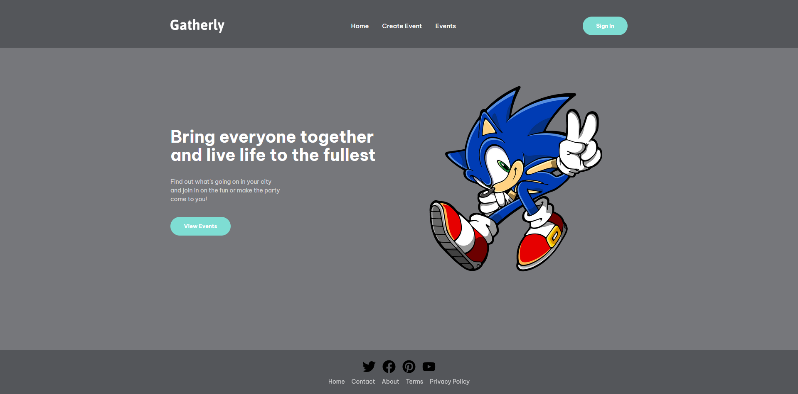

# Gatherly

A web application for creating, managing, and discovering events. It allows users to create accounts, view events, RSVP, and organize gatherings through a simple interface.



## Getting Started

### Prerequisites

- [Node.js](https://nodejs.org) and npm installed
- A MongoDB cluster
- A local MongoDB store

### Setup

1. **Clone the repository:**

```bash
git clone https://github.com/ivanr11/Gatherly.git
cd Gatherly
```

2. **Install dependencies:**

```bash
npm install
```

3. **Set the url (in app.js) to point to your MongoDB cluster. Repeat for local store.**

```bash
url='mongodb+srv://<username>:<password>@cluster0.knjji.mongodb.net/?retryWrites=true&w=majority&appName=Cluster0'
```

```bash
store: new MongoStore({ mongoUrl: "mongodb://127.0.0.1:27017/<your db>" }),
```

4. **Run the app**

```bash
node app.js
```
